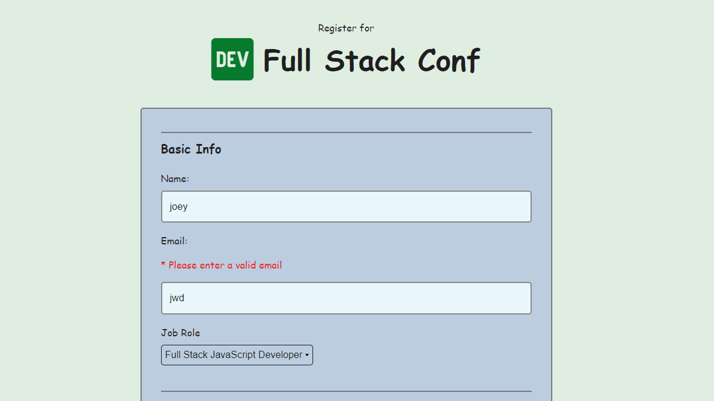
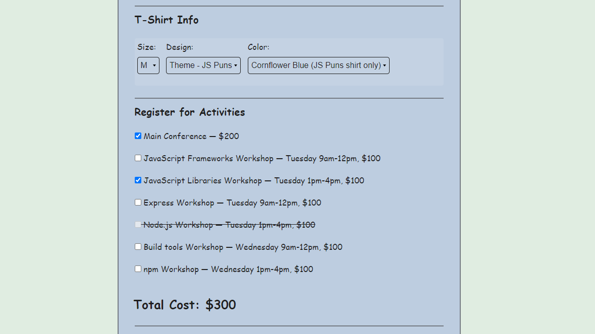
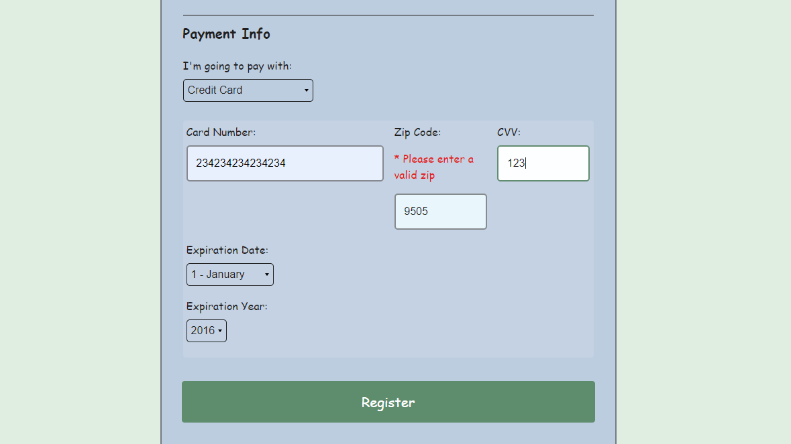

# Interactive Form 
 This project validates user input in real time and manipulates DOM elements.

The HTML and CSS were forked as part of a [Treehouse TechDegree](https://teamtreehouse.com/techdegree/full-stack-javascript) project.  The Javascript files were written by me.

## DOM Manipulation

In this project I use DOM manipulation to query Elements on the HTML page, to create Elements and insert them in to the HTML page. To remove elements from the HTML page. Also I manipulate DOM element attributes. Head over to the GitHub page to see all the DOM manipulation methods used.

## String Manipulation & RegExp

I use string manipulation and regular expressions to validate user input. Searching user input, replacing user input and testing regular expressions are all used. Head over to the GitHub page to see all the string and ReqExp methods used.

## Array Manipulation + ClassList Manipulation

I use array manipulation throughout the project tin partner with DOM manipulation to manipulate Node Lists and to find the correct item in other arrays. I also use classList feature of elements to add and remove classes to them. Head over to the GitHub page to see all the array manipulation methods used.

## ES6 JavaScript Methods Used

#### Event Listener Methods
  - window.addEventListener
  - input.addEventListner

#### DOM Manipulation Methods
  - document.querySelector
  - document.querySelectorAll
  - document.createElement
  - document.createTextNode

  - Element.focus
  
  - Element.removeAttribute
  - Element.hasAttribute
  - Element.getAttribute

  - Element.insertAdjacentHTML
  - Element.appendChild
  - Element.insertBefore

  - Element.remove

#### String Manipulation & RegExp Methods
  - String.replace
  - String.split
  - String.search
  - regExp.test

#### Array Manipulation Methods
  - Array.includes
  - Array.some
  - Array.contains

  - Element.classList.add
  - Element.classList.remove
       

